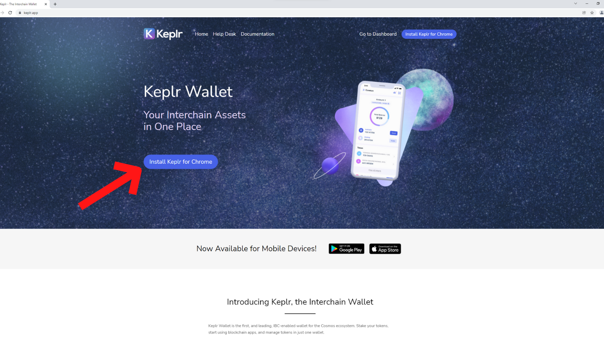

# Creating a Wallet

**In order to enjoy Umee's cross chain DeFi capabilities, an Umee blockchain compatible wallet is needed.**&#x20;


#### _**Before setting up an Umee blockchain compatible wallet, every new user needs to know the following:**_ 

* _**Never share your seed phrase or mnemonic with anyone for any reason;**_
* _**Never enter your seed phrase or mnemonic anywhere;**_
* _**Never engage with unknown links that are shared with you;**_
* _**Never screen share with a stranger;**_
* _**Never sign unknown transactions;**_
* _**Use a hardware wallet for extra security.**_


## Creating an Umee Blockchain Compatible Wallet

**Go to** [<mark style="color:blue;">**keplr.app**</mark>](https://www.keplr.app/) **and select "Install Keplr for Chrome."**


_**The correct URL for the official Keplr website is "**_[_<mark style="color:blue;">**https://www.keplr.app**</mark>_](https://www.keplr.app/)_**"**_



_**Keplr is an interchain, IBC-enabled wallet, which means it can also serve as your wallet for several other blockchains in the Cosmos ecosystem and beyond.**_


****

**Use the Chrome Web Store to add the **<mark style="color:blue;">****</mark> [<mark style="color:blue;">**Keplr extension**</mark>](https://chrome.google.com/webstore/detail/keplr/dmkamcknogkgcdfhhbddcghachkejeap/related) **to Google Chrome.**

****

**Open the Keplr extension and select “Create new account.”**

****

**Select if you’d prefer a 12 or 24 word secret recovery phrase, and write it down.**


_**It's very important that you safely store and never share your secret recovery phrase! This is the only backup to your wallet in the event your device is lost or destroyed.** Failure to properly store and conceal your secret recovery phrase will most likely result in the loss of assets stored in your wallet._


****

**Create a name and password for your wallet, then click “Next.”**

****

**Confirm you have written down your secret phrase properly by clicking the words in the correct order. When you’re finished, click “Register.”**

****

**Congratulations, you’ve officially set up an Umee blockchain compatible wallet!** \
****_Now is a good time to store your secret recovery phrase somewhere safe._

## To Create **Another Wallet** With Keplr

**Select the icon in the upper right corner of the Keplr wallet browser extension.**

****

**Select "Add Account."**

**Choose "Create a new account" and follow the steps given.**

