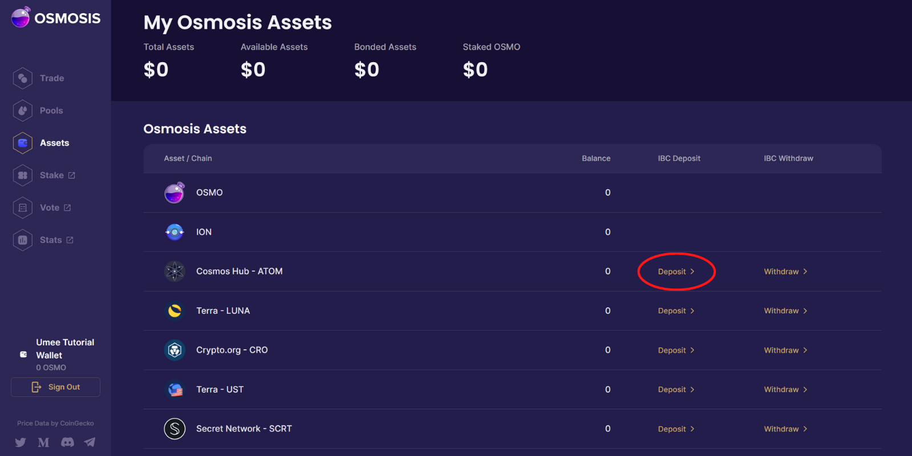
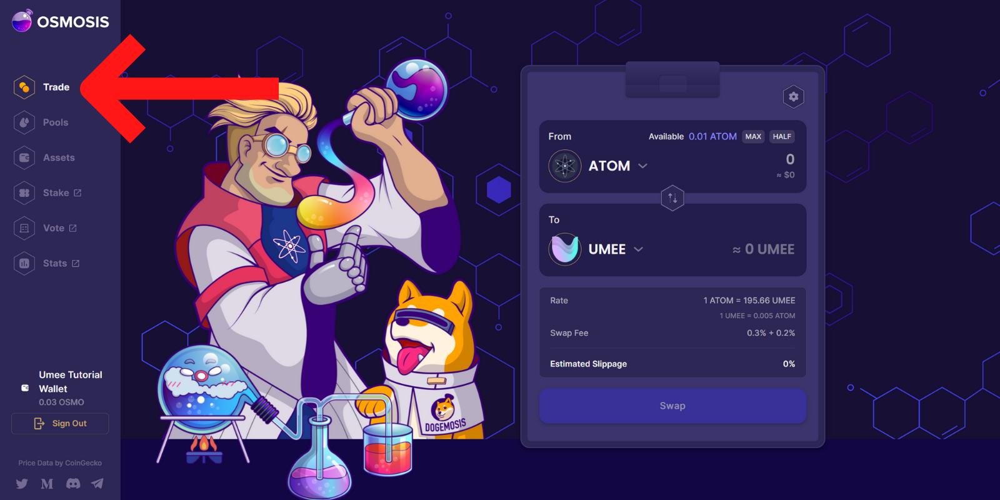
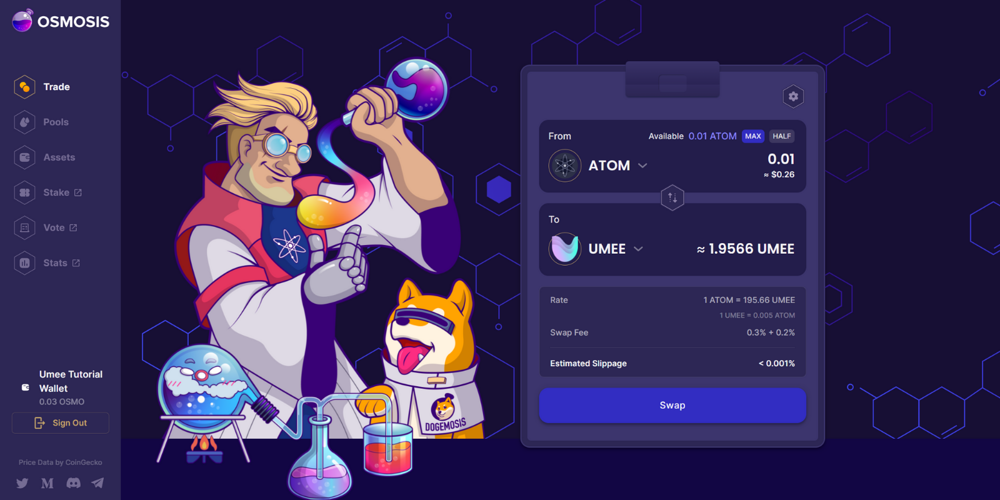
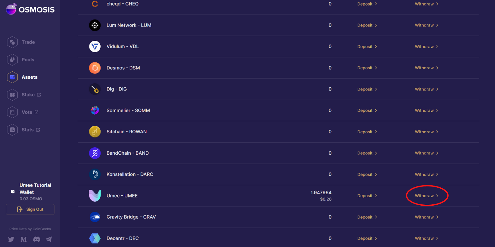

# Purchasing UMEE Tokens

.png>)

**In order to use Umee’s cross chain borrowing and lending features, a **<mark style="color:blue;">****</mark> [<mark style="color:blue;">**native UMEE token**</mark>](../../overview/the-umee-token/) **balance is required.**&#x20;

**It's recommended to purchase UMEE tokens in their** [<mark style="color:blue;">**native format**</mark>](../../overview/the-umee-token/token-format.md)**.** **Native UMEE tokens can instantly be used to** [<mark style="color:blue;">**transact on the Umee blockchain**</mark>](../using-the-web-app/supply-and-withdraw.md)**,** [<mark style="color:blue;">**staked to earn staking yield**</mark>](../staking-umee/)**, and** [<mark style="color:blue;">**used to participate in governance**</mark>](../participating-in-governance.md)**.**


_**If you are in possession of ERC-20 UMEE tokens, please refer to the instructions in the "**_[_<mark style="color:blue;">**Transferring Tokens**</mark>_](../using-the-web-app/transferring-tokens.md)_**" section to learn how to transfer them to the Umee blockchain.**_




## Centralized Exchanges


_**Using a centralized exchange is the easiest way for new users to obtain UMEE tokens.**_



_**Depending on the exchange being used, you may be purchasing **<mark style="color:blue;">****</mark>_ [_<mark style="color:blue;">**native UMEE tokens or ERC-20 Tokens**</mark>_](../../overview/the-umee-token/token-format.md)_**. You can find out which version of the UMEE token you're in possession of by starting the withdrawal process; native UMEE tokens will require an Umee wallet address (umee...), while ERC-20 UMEE tokens will require an Ethereum wallet address (0x...) to be withdrawn.**_


#### The UMEE Token is Currently Purchasable on the Following Centralized Exchanges:

* **OKX**
* **FTX**
* **MEXC**
* **Gate.io**

## If Your Preferred CEX Supports Native UMEE Withdrawals

**Purchase UMEE from your CEX of choice.**\
****\
**Go to the withdrawal section.**

****

**Select the withdraw option for the UMEE token.**\
****

**Copy your Umee wallet address and paste it in the "Send to" section.**\
****

**Select withdraw, approve the withdrawal, and wait for the transaction to process. Your UMEE will appear on the Umee network in your **<mark style="color:blue;">****</mark> [<mark style="color:blue;">**Umee blockchain compatible wallet**</mark>](creating-a-wallet.md) **shortly.**


_**Please note that withdrawing from a CEX may take longer than normal transactions on the Umee network. Don't panic if your tokens do not appear instantly.**_


__

## If Your Preferred CEX Doesn't Support the UMEE Token and/or Native Withdrawals


_**The native Cosmos Hub token, ATOM, is available on most major exchanges. ATOM can be used to quickly easily move funds from a centralized exchange to Umee.**_


**Purchase ATOM from your CEX of choice.**

****\
**Go to the withdrawal section.**

****

**Select the withdraw option for the ATOM token.**\
****

**Copy your Cosmos wallet address found under the "Cosmos Hub" network in your **<mark style="color:blue;">****</mark> [<mark style="color:blue;">**Umee blockchain compatible wallet**</mark>](creating-a-wallet.md)**, and paste it in the "Send to" section.**\
****

**Select withdraw, approve the withdrawal, and wait for the transaction to process. Your ATOM will appear on the Cosmos network in your Umee blockchain compatible wallet shortly.**

****\
**Once the tokens have been received, follow the instructions under the "Cosmos-Based DEX" tab to swap your ATOM for UMEE and transfer funds to the Umee network.**



## Decentralized Exchanges

_**Users who wish to obtain UMEE tokens in their **<mark style="color:blue;">****</mark>_ [_<mark style="color:blue;">**native Umee format**</mark>_](../../overview/the-umee-token/token-format.md) _**without using a centralized exchange can do so by using a Cosmos-based decentralized exchange (DEX).**_

## Purchasing UMEE Tokens on a Cosmos-Based DEX

**Head to Osmosis, or your Cosmos-based DEX of choice, and connect your **<mark style="color:blue;">****</mark> [<mark style="color:blue;">**Umee blockchain compatible wallet**</mark>](creating-a-wallet.md)**.**


_**The correct URL for Osmosis is “**_[_<mark style="color:blue;">**https://app.osmosis.zone/**</mark>_](https://app.osmosis.zone/)_**”**_&#x20;



_**Always double check you are using the correct URL to avoid phishing scams.**_


****

**Select “Assets” from the left sidebar on the Osmosis web app.**

.png>)

****

**Identify the row that contains whichever IBC asset you’d like to trade, and select the “Deposit” option.**

****

**Input the amount you’d like to transfer onto Osmosis, select “Deposit,” and approve the transfer in your wallet. Wait a moment for the transaction to process.**

****

**After your asset of choice has been deposited onto Osmosis, your balance will appear in the “Balance" Column.**

****

**Select “Trade” from the sidebar on the left side of the Osmosis web app.**

****

**Enter  whichever asset you’d like to trade for UMEE in the “From” section. Enter “UMEE” in the “To” section.**

****

**Input the amount of tokens you’d like to trade for UMEE, select “Swap” and approve the transaction in your wallet. Wait a moment for the transaction to process.**

****

**Once the transaction has been processed, go back to the “Assets” section and identify the “UMEE” row to see your balance.**

****

**Select the “Withdraw” option, and withdraw your UMEE from Osmosis to Umee. After the IBC transfer is complete, you will see your UMEE tokens in your Umee wallet.**

### After Withdrawing UMEE From A Cosmos-Based DEX:

**You will now be able to use UMEE tokens to pay for transactions on the Umee blockchain and participate in cross-chain lending and borrowing! You can also:**

* ****[<mark style="color:blue;">**Stake UMEE to earn staking yield**</mark>](../staking-umee/)**;**
* ****[<mark style="color:blue;">**Supply your UMEE on the Umee market to earn lending interest**</mark>](../using-the-web-app/supply-and-withdraw.md)**;**
* ****[<mark style="color:blue;">**Participate in Umee protocol governance**</mark>](../participating-in-governance.md)**.**


