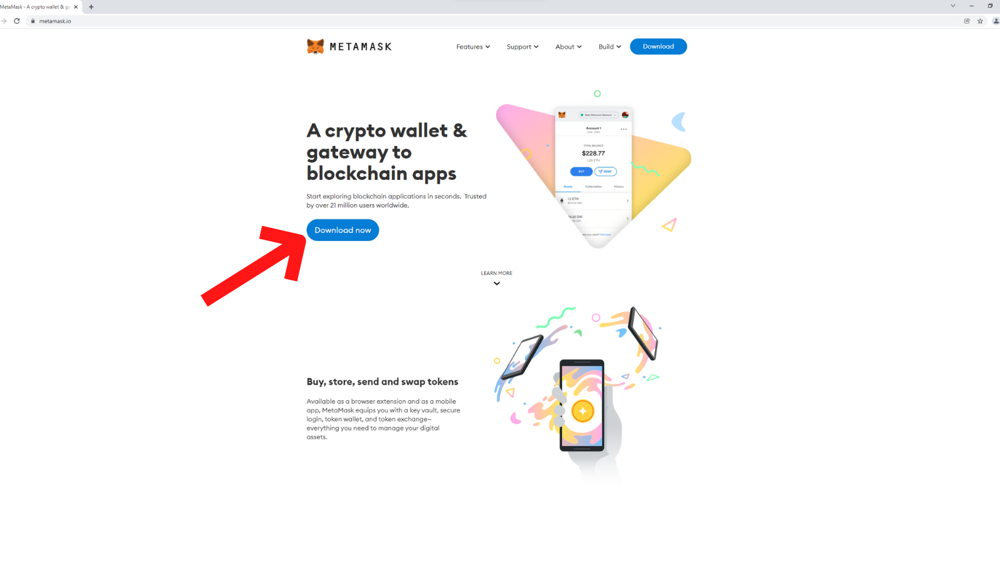

# Setting Up an Ethereum Wallet

In order to use Umee on the Ethereum Network and take advantage of Umee's cross chain DeFi capabilities, you need to have an Ethereum wallet set up.

## Contents:

* [Setting Up an Ethereum Wallet](setting-up-an-ethereum-wallet.md#to-set-up-an-ethereum-wallet)
* [Creating A New Ethereum Wallet Address](setting-up-an-ethereum-wallet.md#to-create-a-new-ethereum-wallet-address)

_For these examples we will be installing the MetaMask wallet on Google Chrome._

## To Set Up an Ethereum Wallet:

**Go to** [**metamask.io**](https://metamask.io/) **and select "Download Now."**


The correct URL for the official MetaMask website is "**https://metamask.io/**"



_Be extra cautious and always double check the URL when creating a wallet in order to avoid phishing scams._&#x20;


****

**Use the Chrome Web Store to add the** [**MetaMask extension**](https://chrome.google.com/webstore/detail/metamask/nkbihfbeogaeaoehlefnkodbefgpgknn) **to Google Chrome.**


The correct URL for the Chrome Web Store MetaMask extension is "**https://chrome.google.com/webstore/detail/metamask/nkbihfbeogaeaoehlefnkodbefgpgknn**"


****

**After confirming, you should be redirected to a welcome page. Click “Get Started.”**

****

**Select “Create a Wallet.”**

****

**Allow or decline MetaMask to collect your usage data.** _Your selection will not impact your ability to create a wallet._

****

**Create and confirm a password, and agree to MetaMask’s Terms of Use.**

****

**Watch the short video and read the information about secret recovery phrases. Click “Next” when you are ready to move on.**

****

**Click on the blurred text to reveal your twelve-word secret recovery phrase.**

**Write down your secret recovery phrase. Once you have it written down, click “Next.”**


_It’s very important that you **safely store** and **never share** your secret recovery phrase! This is the only backup to your wallet in the event your device is lost or destroyed. Failure to properly store and conceal your secret recovery phrase will most likely result in the loss of assets stored in your wallet._


**Confirm you have written down your secret phrase properly by clicking the words in the correct order. When you’re finished, click “Confirm.”**

**You have now set up your Ethereum wallet!** \
****_Now is a good time to store your secret recovery phrase somewhere safe._

## To Create A New Ethereum Wallet Address:

**Open your wallet's browser extension and select the "My Accounts" circle in the top right corner.**

.png>)

**Select "Create Account," and name the new wallet.**

.png>)

_Tip: To make your wallet easily accessible, pin the extension. You can do this by selecting the “Extensions” button in the upper right corner of your browser (it looks like a puzzle piece) and then selecting the pin icon._

