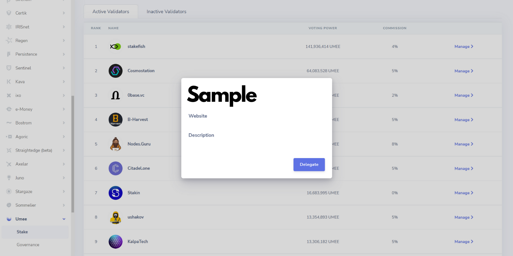

# 🔓 Staking UMEE

<mark style="color:blue;"></mark>[<mark style="color:blue;">**Native UMEE token holders**</mark>](../../overview/the-umee-token/token-format.md) **can help secure the Umee Network by staking their UMEE. Staking UMEE allows a user to generate steady Proof-of-Stake yield with minimal risk.** [_<mark style="color:blue;">**Learn more about staking here**</mark>_](../../overview/blockchain-basics/pow-vs-pos.md#staking)_**.**_


_**Before staking your native UMEE tokens, please note:**_

* _**Staked tokens are non-transferable;**_
* _**There is a 14 day unbonding period for all staked tokens.**_



### _**Prerequisites**_

* _**Must have an**_ [_<mark style="color:blue;">**Umee blockchain compatible wallet**</mark>_](../getting-started/creating-a-wallet.md) _**with an **<mark style="color:blue;">****</mark>_ [_<mark style="color:blue;">**UMEE token balance**</mark>_](../getting-started/purchasing-umee-tokens.md)_**;**_
* _**Must have a basic understanding of how staking works and**_ [_<mark style="color:blue;">**how to choose a validator**</mark>_](selecting-a-validator.md)_**.**_




.png>)

## Staking UMEE

**Sign into your Keplr wallet and select the Umee network from the dropdown list.**

.png>)

****

**Select "Stake" at the bottom of the Keplr wallet browser extension.**

****

**You will now see a list of all active Umee validators.** [<mark style="color:blue;">**Please refer to the "Selecting a Validator" section to learn how to make an informed decision before delegating your tokens**</mark>](selecting-a-validator.md)**.**

.png>)

****

**After finding a validator you’d like to delegate your stake to, select “Manage” and then “Delegate."**

****

**Input the amount of Umee tokens you’d like to stake with this validator.**


_**Don’t forget to keep some UMEE in your wallet to be able to use the Umee Network.**_


****

**Select “Delegate” and confirm the transaction in your wallet.**\
__

**Congratulations, you have now staked your Umee tokens!** _You will begin accruing staking rewards immediately._



## To Claim Staking Rewards:

**Sign into your Keplr wallet and select the Umee network from the dropdown list.**\
****

**Select "Claim" at the bottom of your Keplr wallet browser extension.**\
****

**Approve the “Claim Staking Reward” transaction that pops up.**\
****

**You have now successfully claimed your Umee token staking reward!**


