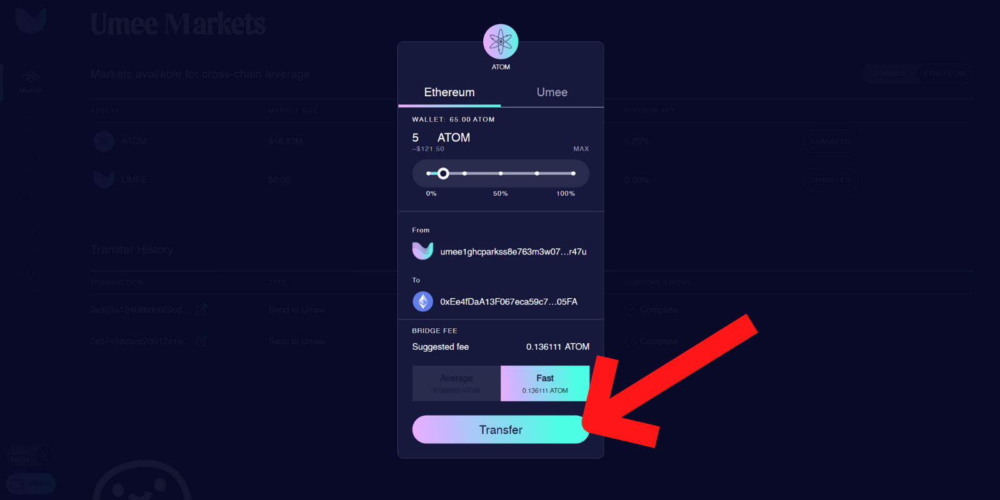

# Bridging


_**Before bridging make sure you have testnet UMEE in your Umee wallet and testnet ETH in your Ethereum wallet for gas fees. See "**_[_<mark style="color:blue;">**Using Testnet Faucets**</mark>_](using-testnet-faucets.md)_**" for more information.**_


## To Bridge Between Umee & Ethereum:

**Make sure your Umee and Ethereum wallets are both connected to the web app, and your Ethereum wallet is connected to the "Goerli Test Network."**

.png>)

**On the markets page, change the toggle switch in the upper right corner to the ecosystem you'd like to transfer TO.**

**Identify which asset you’d like to transfer, and select the “Transfer” button in the appropriate row.**

**On the top of the pop-up, select which network you’re transferring tokens TO.**

**Input the amount of tokens you'd like to transfer.**

**Adjust the bridge fee as desired.**


_**When bridging from Umee to Ethereum the "Fast" option is recommended.**_


**Select "Transfer" and confirm the transaction in your wallet.**


_**Transfers between Umee and Ethereum may take significantly longer than IBC transfers to process.**_


